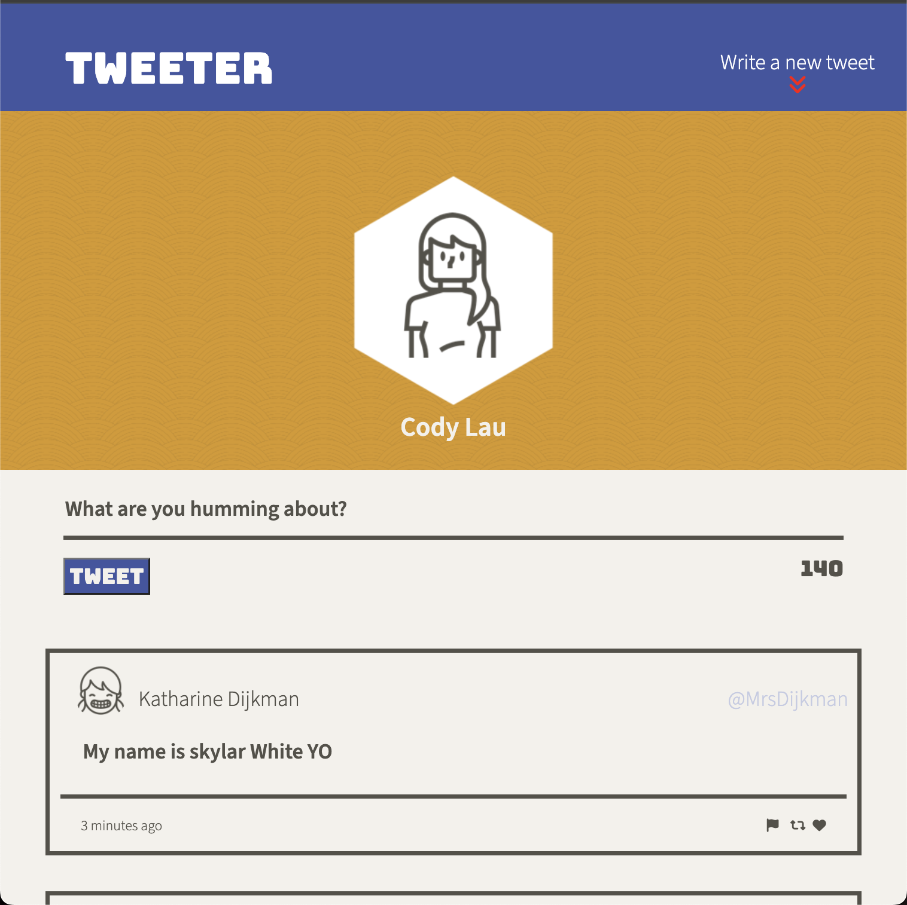
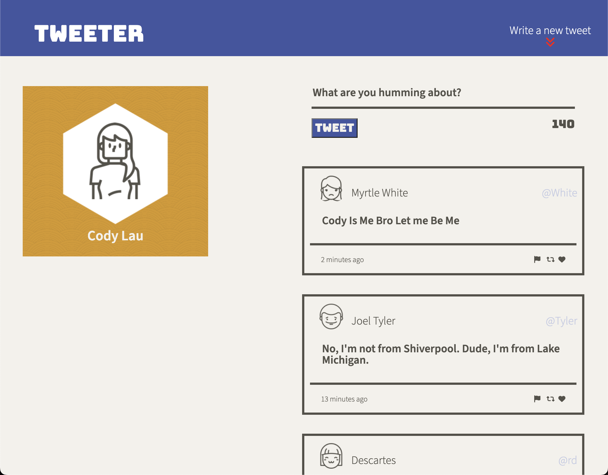
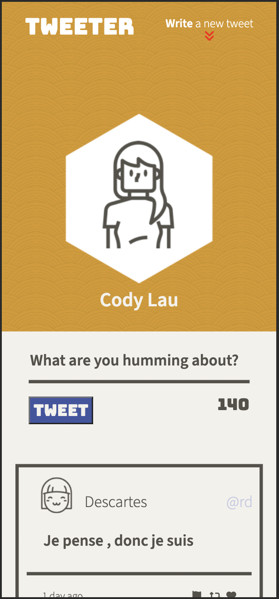

# Tweeter Project

Tweeter is a simple, single-page Twitter clone. Tweeter provides users with a simple platform to share their thoughts, commonly known as "tweets."

This web application implements a combination of front-end skills such as using HTML, CSS, JS, jQuery, and AJAX, along with back-end skills utilizing Node.js and Express. 

## Features
- User-Friendly Interface
  - Effortlessly compose and submit tweets with a seamless interface.

- Asynchronous Communication
  - AJAX for responsive, real-time server communication.

- Dynamic Content Updates 
  - jQuery enables instant HTML updates without page reloads.

- Error Handling 
  - Clear error messages prevent invalid tweets, enhancing user experience.

- Dynamic Character Counter 
  - Live update on remaining characters for tweet composition.

- Responsive Web Design 
  - Consistent and optimal user experience across devices.

- Server-Side Handling 
  - Node.js and Express manage tweet submissions and data retrieval.

## Final product

## Getting Started

1. [Create](https://docs.github.com/en/repositories/creating-and-managing-repositories/creating-a-repository-from-a-template) a new repository using this repository as a template.
2. Clone your repository onto your local device.
3. Install dependencies using the `npm install` command.
3. Start the web server using the `npm run local` command. The app will be served at <http://localhost:8080/>.
4. Go to <http://localhost:8080/> in your browser.

## Dependencies

- Express
- Node 5.10.x or above
- body-parser
- chance
- md5